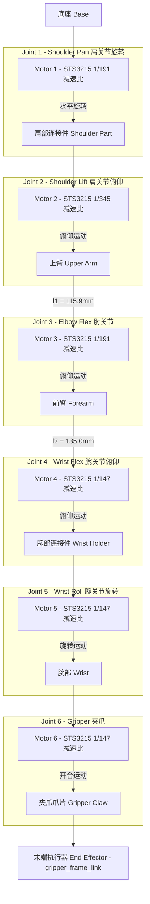

让我先了解一下项目中关于 SO101 机械臂的信息。

根据项目代码和文档中的信息，以下是 SO-101 机械臂的结构示意图：

**SO-101 机械臂关键参数总结：**

| 关节 | 名称 | 电机 | 减速比 | 运动类型 |
|------|------|------|--------|----------|
| Joint 1 | Shoulder Pan（肩部旋转） | STS3215 | 1/191 | 水平旋转 |
| Joint 2 | Shoulder Lift（肩部俯仰） | STS3215 | 1/345 | 俯仰 |
| Joint 3 | Elbow Flex（肘关节） | STS3215 | 1/191 | 俯仰 |
| Joint 4 | Wrist Flex（腕部俯仰） | STS3215 | 1/147 | 俯仰 |
| Joint 5 | Wrist Roll（腕部旋转） | STS3215 | 1/147 | 旋转 |
| Joint 6 | Gripper（夹爪） | STS3215 | 1/147 | 开合 |

- **自由度**：6 DOF
- **上臂长度 l1**：115.9 mm
- **前臂长度 l2**：135.0 mm
- **电机通信**：Feetech 总线舵机，通过 USB 转串口控制
- **URDF 模型**：`so101_new_calib.urdf`（来自 [SO-ARM100 仓库](https://github.com/TheRobotStudio/SO-ARM100)）
- **运动学求解**：[SO101Kinematics](file:///Users/jim/lerobot/src/lerobot/model/SO101Robot.py) 类提供正/逆运动学