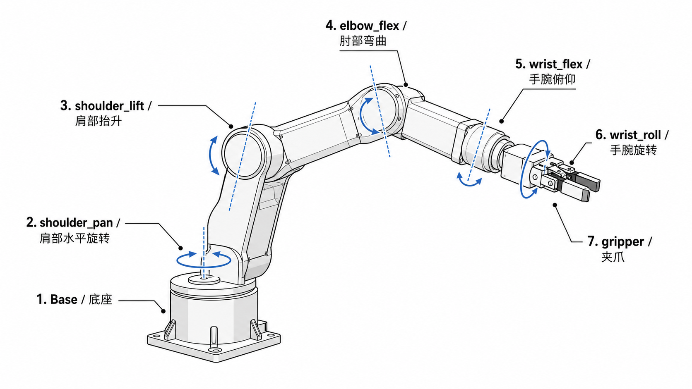

# SO101 部位说明图



## 关节与部位对应

| 关节名 | 中文说明 | 作用 |
| --- | --- | --- |
| `Base` | 底座 | 支撑整条机械臂 |
| `shoulder_pan` | 肩部水平旋转 | 控制机械臂左右摆动 |
| `shoulder_lift` | 肩部抬升 | 控制大臂上下抬升 |
| `elbow_flex` | 肘部弯曲 | 控制前臂弯曲与伸展 |
| `wrist_flex` | 手腕俯仰 | 控制夹爪端上下俯仰 |
| `wrist_roll` | 手腕旋转 | 控制夹爪端绕自身轴旋转 |
| `gripper` | 夹爪 | 控制夹爪开合 |

## 脚本中的左右臂字段

```text
left_arm_shoulder_pan      right_arm_shoulder_pan
left_arm_shoulder_lift     right_arm_shoulder_lift
left_arm_elbow_flex        right_arm_elbow_flex
left_arm_wrist_flex        right_arm_wrist_flex
left_arm_wrist_roll        right_arm_wrist_roll
left_arm_gripper           right_arm_gripper
```

## Joy-Con 控制对应关系

在 `7_xlerobot_2wheels_teleop_joycon_smooth.py` 中，左右 Joy-Con 分别控制左右 SO101 机械臂：

| Joy-Con 操作 | 控制内容 |
| --- | --- |
| 摇杆上下 | 控制末端前后移动，并受 Joy-Con 俯仰角影响带动 Z 方向 |
| 摇杆左右 | 控制末端左右移动 |
| R / L | 控制对应手臂末端 Z 轴上升 |
| 按下右摇杆 / 按下左摇杆 | 控制对应手臂末端 Z 轴下降 |
| ZR / ZL | 控制对应夹爪开合 |
| 倾斜 Joy-Con | 控制 `wrist_flex` 和 `wrist_roll` |

